

<h1>Building Blocks for Multi-Agent Design</h1>

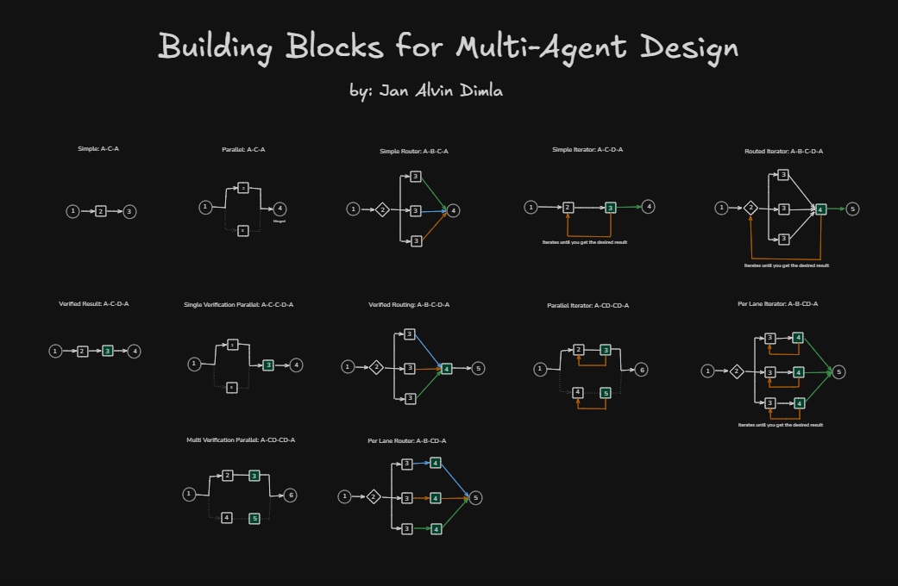

This a collection of building blocks that you can use for creating Multi-Agent Design for AI. This includes screenshots and a detailed explanation of what it is and why it is important.

 

 

---

## What is a Building Block?

You can think of a building blocks a node or a cell that connects to another one forming a comprehensive system. Building this system can either be **procedural** (randomly generated) or pre-defined if you want to maintain a certain level of control. Think of **Lego**.

I have created this collection to help me (and hopefully others as well) design my own AI Agents for work and for personal use. And this saves you a lot of time of thinking and planning.

I hope this helps.

---

## The Blocks

- [Simple: A-C-A](https://github.com/sedna16/building-blocks-for-multi-agent-design#simple-a-c-a)
- [Verified Result: A-C-D-A](https://github.com/sedna16/building-blocks-for-multi-agent-design#verified-result-a-c-d-a)
- [Parallel: A-C-A](https://github.com/sedna16/building-blocks-for-multi-agent-design#parallel-a-c-a)
- [Single Verification Parallel: A-C-C-D-A](https://github.com/sedna16/building-blocks-for-multi-agent-design#single-verification-parallel-a-c-c-d-a)
- [Multi-Verify Parallel: A-CD-CD-A](https://github.com/sedna16/building-blocks-for-multi-agent-design#multi-verify-parallel-a-cd-cd-a)
- [Simple Router: A-B-C-A](https://github.com/sedna16/building-blocks-for-multi-agent-design#simple-router-a-b-c-a)
- [Verified Router: A-B-C-D-A](https://github.com/sedna16/building-blocks-for-multi-agent-design#verified-router-a-b-c-d-a)
- [Per Lane Verified Router: A-B-CD-A](https://github.com/sedna16/building-blocks-for-multi-agent-design#per-lane-verified-router-a-b-cd-a)
- [Simple Iterator: A-C-D-A](https://github.com/sedna16/building-blocks-for-multi-agent-design#simple-iterator-a-c-d-a)
- [Parallel Iterator: A-CD-CD-A](https://github.com/sedna16/building-blocks-for-multi-agent-design#parallel-iterator-a-cd-cd-a)
- [Routed Iterator: A-B-C-D-A](https://github.com/sedna16/building-blocks-for-multi-agent-design#routed-iterator-a-b-c-d-a)
- [Per Lane Iterator: A-B-CD-A](https://github.com/sedna16/building-blocks-for-multi-agent-design#per-lane-iterator-a-b-cd-a)
- [Perpetual: A-CC-A](https://github.com/sedna16/building-blocks-for-multi-agent-design#perpetual-a-cc-a)
- more will follow.

---

## Simple: A-C-A

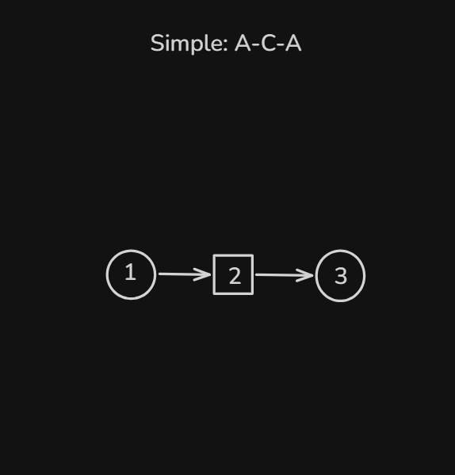

##### What it is:
This is the most simple block in the list, it receives input, passes it to an agent, then produces output. Nothing too complicated.

##### Why its useful:
If you need simple nodes for your system, this is an agent that does nothing but produces output based on its knowledge pool. Very simple to setup.

---

## Verified Result: A-C-D-A

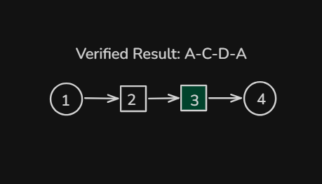

##### What it is:
This is an example of a sequential multi-agent design, but inside a node. You can still connect these (as well as other blocks on the list) to other nodes whenever needed.

##### Why its useful:
Sometimes you will need to use another agent to verify if the output of your agent is correct and accurate, this node will do that. 

---

## Parallel: A-C-A

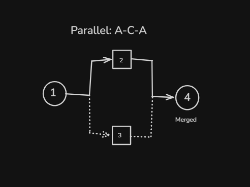

##### What it is:
This is an example of a parallel multi-agent design. Multiple agents run "asynchronously" to produce results for merging.

##### Why its useful:
You would use this if you need results from multiple source to merge them into 1 output.

---

## Single Verification Parallel: A-C-C-D-A

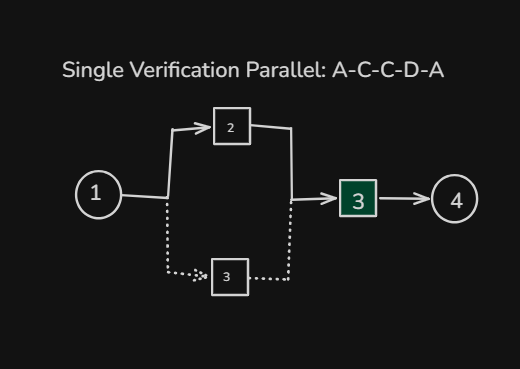

##### What it is:
A parallel multi-agent node with a verifier before pushing for output.

##### Why its useful:
You would use this if you need to verify the results of more than 1 agents at the same time. 

---

## Multi-Verify Parallel: A-CD-CD-A

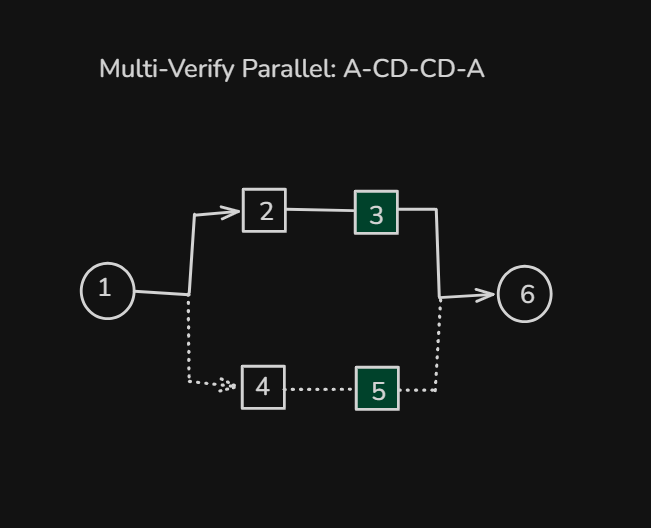

##### What it is:
Almost the same with the previous one. But for this node, the verification happens on the parallel lane before merging.

##### Why its useful:
If you need to verify the output for each parallel lane before merging them, than you will need this type of block.

---

## Simple Router: A-B-C-A

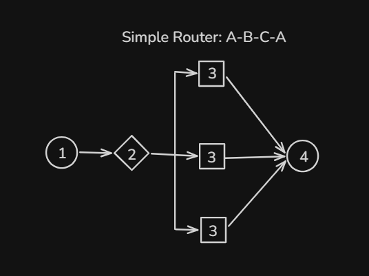

##### What it is:
This Simple Router node lets your agent choose the right tool or sub-agent to produce results. Your agent would choose 1 from the selection of routes.

##### Why its useful:
Use this node if you need to give your agent a certain degree of freedom in operation. Just provide the necessary tools and sub-agent and let your ai do the rest.

---

## Verified Router: A-B-C-D-A

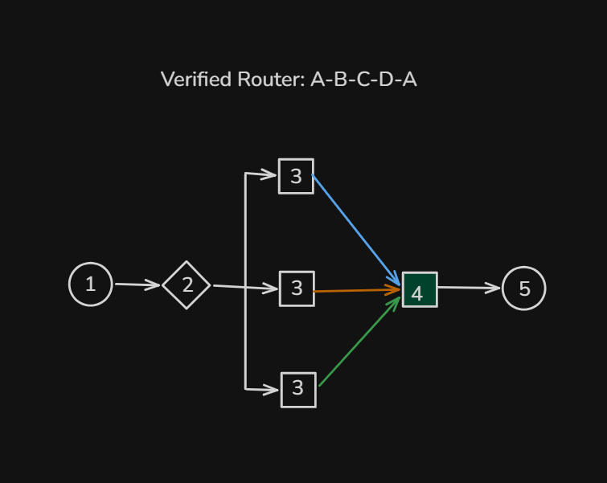

##### What it is:
This is just a simple router with an added verifier.

##### Why its useful:
If you need to verify the result of the selected route (tool/sub-agent), you need to use this type of node/block.

---

## Per Lane Verified Router: A-B-CD-A

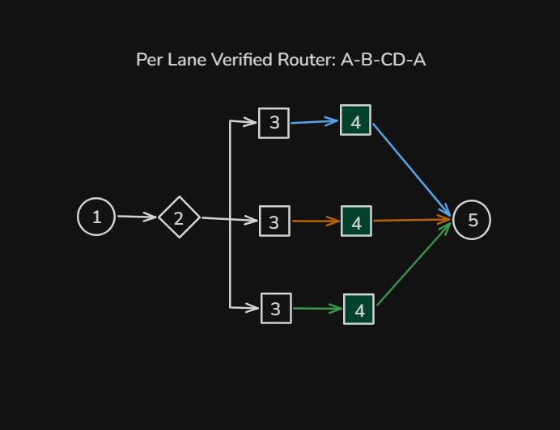

##### What it is:
Sometimes your verification process may differ based on the tool/sub-agent that was used, this block helps you verify if the result from the route is correct.

##### Why its useful:
This is used if you need to have all of your results verified.

---

## Simple Iterator: A-C-D-A

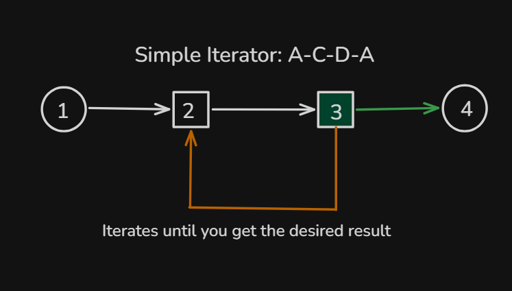

##### What it is:
This is a simple sequential multi-agent node with a verifier, but this time if the level of correctness is below a certain threshold this node will re-run the agent until it is correct.

##### Why its useful:
Best to use for certain fields, e.g. medical and law. They need to have their result grounded on real-world facts and accurate. Why? becaue damages/penalty/fines can be high.

---

## Parallel Iterator: A-CD-CD-A

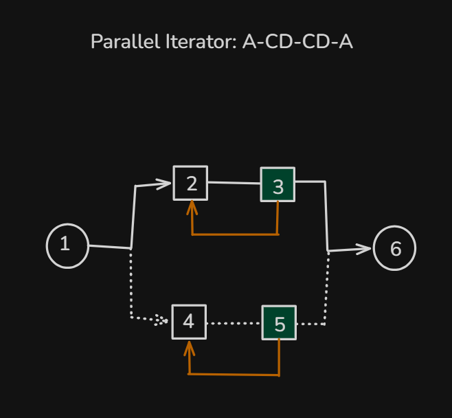

##### What it is:
This is just Single Verification Parallel block, but the system will re-run the agent until the result is correct.

##### Why its useful:
Same reason as the previous one, but this is used if your results will come from multiple sources.

---

## Routed Iterator: A-B-C-D-A

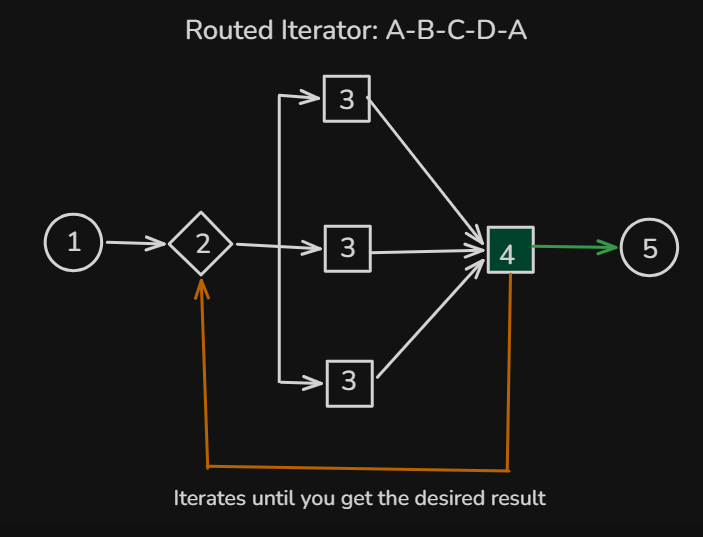

##### What it is:
This is a verified router, and the system or node will re-run the "router" if the result is incorrect. Regardless of the route previously chosen.

##### Why its useful:
You would use this if you need a "self-correcting router".

---

## Per Lane Iterator: A-B-CD-A

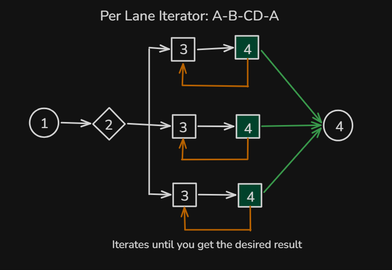

##### What it is:
A router node that has a verifier and iterator on each route.

##### Why its useful:
If you only need to iterate or self-correct on the chosen route and does not need to choose another one, this node will do that.

---

## Perpetual: A-[CC]-A

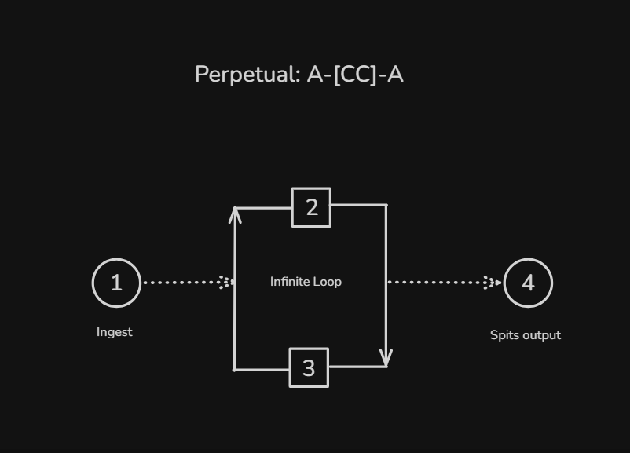

##### What it is:
This is an example of a multi-agent node that will keep running 24/7. Producing result will not stop it from having another one.

##### Why its useful:
If you need results to be produced on an interval or scheduled, this is the node is suited for that.

---

## More will follow.

